## Main Contributor
Pranav Balaji Balachandran

## Overview
This project implements a simple driver drowsiness detection system using OpenCV and MediaPipe. It captures video from a webcam, detects eye landmarks using the MediaPipe Face Mesh model, and calculates the Eye Aspect Ratio (EAR) to measure whether the eyes are open or closed. If the EAR stays below a defined threshold for a certain number of consecutive frames, the system considers the driver drowsy and displays an on-screen alert. Along with this, it visualizes eye landmarks and EAR values in real-time, making it a lightweight and effective method for monitoring driver fatigue.

## Table of Contents
- [Architecture Diagram](#architecture-diagram)
- [Component Functionalities](#component-Functionalities)
- [License](#license)

## Architecture diagram

```mermaid
   graph LR
    %% Style for topics (rounded rectangles with colored fill and border)
    style VideoFrames stroke:#3498DB,stroke-width:3px,fill:#5DADE2,rx:10,ry:10,color:#222
    style FaceLandmarks stroke:#3498DB,stroke-width:3px,fill:#5DADE2,rx:10,ry:10,color:#222
    style EyeAspectRatio stroke:#3498DB,stroke-width:3px,fill:#5DADE2,rx:10,ry:10,color:#222
    style DrowsinessAlert stroke:#3498DB,stroke-width:3px,fill:#5DADE2,rx:10,ry:10,color:#222

    %% Nodes (components)
    style Webcam stroke:#000,stroke-width:2px,fill:#fff,color:#000
    style OpenCV stroke:#000,stroke-width:2px,fill:#fff,color:#000
    style MediaPipe stroke:#000,stroke-width:2px,fill:#fff,color:#000
    style EARCalculator stroke:#000,stroke-width:2px,fill:#fff,color:#000
    style DrowsinessLogic stroke:#000,stroke-width:2px,fill:#fff,color:#000
    style Display stroke:#000,stroke-width:2px,fill:#fff,color:#000

    %% Components
    Webcam["Webcam"]
    OpenCV["OpenCV (Frame Capture)"]
    MediaPipe["MediaPipe Face Mesh"]
    EARCalculator["EAR Calculator"]
    DrowsinessLogic["Drowsiness Detection Logic"]
    Display["Output Display (OpenCV Window)"]

    %% Topics
    VideoFrames["/video_frames"]
    FaceLandmarks["/face_landmarks"]
    EyeAspectRatio["/eye_aspect_ratio"]
    DrowsinessAlert["/drowsiness_alert"]

    %% Flow
    Webcam -->|Captured Frames| VideoFrames
    VideoFrames -->|BGR to RGB| OpenCV
    OpenCV --> MediaPipe
    MediaPipe -->|Facial Landmarks| FaceLandmarks
    FaceLandmarks --> EARCalculator
    EARCalculator -->|EAR Values| EyeAspectRatio
    EyeAspectRatio --> DrowsinessLogic
    DrowsinessLogic -->|Alert Trigger| DrowsinessAlert
    DrowsinessLogic --> Display
    EARCalculator --> Display
    MediaPipe --> Display
```

## Component functionalities
- Eye Landmark Detection (MediaPipe Face Mesh)

  - Uses MediaPipe FaceMesh with refine_landmarks=True.

  - Detects 468 facial landmarks, including eyes.

  - Eye landmarks are extracted using predefined indices:

  - LEFT_EYE = [33, 160, 158, 133, 153, 144]

  - RIGHT_EYE = [362, 385, 387, 263, 373, 380]

- Eye Aspect Ratio (EAR) Calculation

  - Formula:
EAR = (‖p2 - p6‖ + ‖p3 - p5‖) / (2 × ‖p1 - p4‖)

  - Measures vertical eye opening relative to horizontal eye width.

  - Low EAR indicates closed or nearly closed eyes.

-  Drowsiness Detection Logic

   - EAR Threshold = 0.20

   - If EAR < threshold for 50 consecutive frames → trigger alert.

   - Avoids false alarms from normal blinking.

- Visualization

  - Draws green circles on eye landmarks.

  - Displays EAR value on top-left corner.

  - Displays “DROWSY ALERT!” when drowsiness is detected.

- System Control

  - Press ESC key to exit program.

  - Uses OpenCV windows for live output.
## License

This project is licensed under the **Apache 2.0 License** - see the [LICENSE](LICENSE) file for details.
